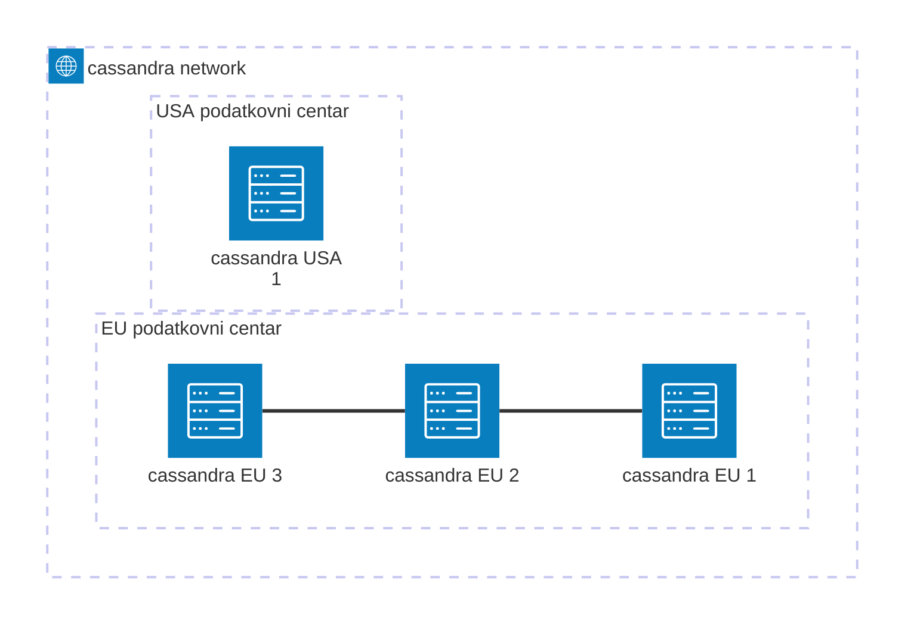

# Analiza Cassandra DBMS-a s prakitičnim primjerima

## Priprema radnog okruženja
Za ovaj primjer demonstracije i testiranja Cassandra DBMS-a, koristi se Docker Desktop koji je moguće preuzeti sa Docker službenih stranica za Windows, Linux i MacOS operativne sustave. https://docs.docker.com/desktop/ 

Nakon Docker instalacije, potrebno je preuzeti image koji će se koristiti za pokretanje Cassandra čvorova. Cassandra održava službeni Docker image koji se preuzima izvršavanjem naredbe u terminalu
```
docker pull cassandra:latest
```
Prije pokretanja prvog čvora, postavlja se Docker mreža na koju će biti spojeni Cassandra čvorovi. Mrežu nije pootrebno postavljati ako će se koristiti jedan čvor. Naziv mreže je proizvoljan, u primjeru se koristi cassandra-network kao naziv mreže. 
```
docker network create cassandra-network
```

### Arhitektura čvorova
U dva podatkovna centra EU i USA pokreću se 4 Cassandra čvora. Tri čvora u EU podatkovnom centru i jedan u USA podatkovnom centru. Cilj primjera s više čvorova je demonstrirati različite razine konzistencije i faktore replikacije. Više o tome u nastavku. 



### Pokretanje prvog čvora
Za pokretanje prvog čvora koristi se naredba u nastavku. S tom naredbom, Docker pokreće Cassandra čvor s definiranim nazivima u mreži koja je prethodno pokrenuta i koristi najnoviji Cassandra image koji je dostupan i instaliran. 
```
docker run -d \
--name cassandra-eu-1 \
--hostname cassandra-eu-1 \
--network cassandra-network \
-p 9042:9042 \
-e CASSANDRA_SEEDS=cassandra-eu-1,cassandra-usa-1 \
-e CASSANDRA_CLUSTER_NAME=CassandraCluster \
-e CASSANDRA_DC=EU \
-e CASSANDRA_RACK=rack1 \
-e CASSANDRA_ENDPOINT_SNITCH=GossipingPropertyFileSnitch \
-e MAX_HEAP_SIZE=1G \
-e HEAP_NEWSIZE=200M \
-v cassandra-eu-node1-data:/var/lib/cassandra \
cassandra:latest
```
> [!TIP]
> Prije pokretanja idućeg čvora, preporuka je pričekati dvije do tri minute, odnosno dok se prethodni čvor ne pokrene zbog povećanje potrošnje RAM-a

Pokretanje drugog čvora
```
docker run -d \
--name cassandra-eu-2 \
--hostname cassandra-eu-2 \
--network cassandra-network \
-p 9043:9042 \
-e CASSANDRA_SEEDS=cassandra-eu-1,cassandra-usa-1 \
-e CASSANDRA_CLUSTER_NAME=CassandraCluster \
-e CASSANDRA_DC=EU \
-e CASSANDRA_RACK=rack1 \
-e CASSANDRA_ENDPOINT_SNITCH=GossipingPropertyFileSnitch \
-e MAX_HEAP_SIZE=1G \
-e HEAP_NEWSIZE=200M \
-v cassandra-eu-node2-data:/var/lib/cassandra \
cassandra:latest
```
Pokretanje trećeg čvora
```
docker run -d \
--name cassandra-eu-3 \
--hostname cassandra-eu-3 \
--network cassandra-network \
-p 9044:9042 \
-e CASSANDRA_SEEDS=cassandra-eu-1,cassandra-usa-1 \
-e CASSANDRA_CLUSTER_NAME=CassandraCluster \
-e CASSANDRA_DC=EU \
-e CASSANDRA_RACK=rack1 \
-e CASSANDRA_ENDPOINT_SNITCH=GossipingPropertyFileSnitch \
-e MAX_HEAP_SIZE=1G \
-e HEAP_NEWSIZE=200M \
-v cassandra-eu-node3-data:/var/lib/cassandra \
cassandra:latest
```

Pokretanje četvrtog čvora (USA podatkovni centar) 
```
docker run -d \
--name cassandra-usa-1 \
--hostname cassandra-usa-1 \
--network cassandra-network \
-p 9045:9042 \
-e CASSANDRA_SEEDS=cassandra-eu-1,cassandra-usa-1 \
-e CASSANDRA_CLUSTER_NAME=CassandraCluster \
-e CASSANDRA_DC=USA \
-e CASSANDRA_RACK=rack1 \
-e CASSANDRA_ENDPOINT_SNITCH=GossipingPropertyFileSnitch \
-e MAX_HEAP_SIZE=1G \
-e HEAP_NEWSIZE=200M \
-v cassandra-usa-node1-data:/var/lib/cassandra \
cassandra:latest
```

Nakon pokretanja svih čvorova, pregled njihovog stanja je pokazano u Docker Desktopu (zeleni indikator), a stanje čvorova je moguće provjeriti i izvršavanjem naredbe nodetool status u terminalu. Čvorovi trebaju biti prikazani i imati status UN (Up/Normal). 
```
docker exec cassandra-eu-1 nodetool status
```
```
Datacenter: EU
==============
Status=Up/Down
|/ State=Normal/Leaving/Joining/Moving
--  Address     Load        Tokens  Owns (effective)  Host ID                               Rack 
UN  172.18.0.3  347.01 KiB  16      100.0%            8a177d26-a484-49e8-be6a-0f2ae9541943  rack1
UN  172.18.0.2  390.88 KiB  16      100.0%            40060547-b1e0-4dc0-8014-7eb0420c5fee  rack1
UN  172.18.0.5  370.05 KiB  16      100.0%            fc541fd4-b5cc-4b65-a9a8-a50268becc31  rack1

Datacenter: USA
===============
Status=Up/Down
|/ State=Normal/Leaving/Joining/Moving
--  Address     Load        Tokens  Owns (effective)  Host ID                               Rack 
UN  172.18.0.4  361.09 KiB  16      100.0%            2d510950-1c70-40a3-b2f1-c2b59b97a1b6  rack1
```


### Dodatne konfiguracije

#### Autorizacija korisnika

Autentifikacija i autorizacija korisnika je inicijalno onemogućena. Za omogućavanje potrebno je izmijeniti cassandra.yaml konfioguravijske datoteke na svim čvorovima. Konfiguracijska datoteka se nalazi u /etc/cassandra/cassandra.yaml


Potrebno je izmijeniti autentifikator iz AllowAllAuthenticator u PasswordAuthenticator i authorizer iz AllowAllAuthorizer u CassandraAuthorizer

```
authenticator: PasswordAuthenticator
```
```
authorizer: CassandraAuthorizer
```
> [!IMPORTANT]
> Konfiguracijske datoteke je potrebno izmijeniti na svim čvorovima i napraviti ponovno pokretanje svih čvorova

> [!IMPORTANT]
> Zadani korisnik je *cassandra*, a lozinka je *cassandra*

#### Omogućvanje audit loga

Za praćenje korisničkih aktivnosti, potrebno je omogućiti bilježenje audit loga. Prvi korak je omogućavanje audit loga izmjenom /etc/cassandra/logback.xml datoteke. Potrebno je pronaći sekciju za audit i ukloniti komentare. 


```
<!-- Uncomment below configuration (Audit Logging (FileAuditLogger) rolling file appender and Audit Logging
  additivity) in order to have the log events flow through separate log file instead of system.log.
  Audit Logging (FileAuditLogger) rolling file appender to audit.log -->
  <appender name="AUDIT" class="ch.qos.logback.core.rolling.RollingFileAppender">
    <file>${cassandra.logdir}/audit/audit.log</file>
    <rollingPolicy class="ch.qos.logback.core.rolling.SizeAndTimeBasedRollingPolicy"> 
       <!-- rollover daily -->
       <fileNamePattern>${cassandra.logdir}/audit/audit.log.%d{yyyy-MM-dd}.%i.zip</fileNamePattern> 
       <maxFileSize>50MB</maxFileSize>
      <maxHistory>30</maxHistory>
      <totalSizeCap>5GB</totalSizeCap>
    </rollingPolicy>
    <encoder>
      <pattern>%-5level [%thread] %date{ISO8601} %F:%L - %msg%n</pattern>
    </encoder>
  </appender> 

  <!-- Audit Logging additivity to redirect audit logging events to audit/audit.log -->
   <logger name="org.apache.cassandra.audit" additivity="false" level="INFO">
    <appender-ref ref="AUDIT"/>
  </logger>
```

Drugi korak je u cassandra.yaml konfiguraciji omogućiti audit log izmjenom enabled iz false u true i odabrati logger FileAuditLogger. Ovdje je također moguće odabrati što će se bilježiti u audit logu. Praćenje je moguće po keyspacu, korisniku i kategorijama. Kategorije su QUERY, DML, DDL, DCL, OTHER, AUTH, ERROR i PREPARE. Ako se ostavi bez konfiguracije, bilježi se sve. 
```
# Audit logging - Logs every incoming CQL command request, authentication to a node. See the docs
# on audit_logging for full details about the various configuration options and production tips.
audit_logging_options:
  enabled: true
  logger: FileAuditLogger
  # audit_logs_dir: /var/log/cassandra/audit
  # included_keyspaces:
  # excluded_keyspaces: system, system_schema, system_virtual_schema
  # included_categories:
  # excluded_categories:
  # included_users:
  # excluded_users:
```


Audit logovi se spremaju u /var/log/cassandra/audit/audit.log, a lokacija se može izmijeniti u prethodnoj konfiguraciji gdje je potrebno odrediti apsolutnu putanju do mape.

Primjer jednog audit log zapisa: 
```
INFO  [Native-Transport-Auth-Requests-1] 2025-11-11 16:30:13,337 FileAuditLogger.java:51 - user:cassandra|host:/172.18.0.2:7000|source:/127.0.0.1|port:53834|timestamp:1762878613337|type:LOGIN_SUCCESS|category:AUTH|operation:LOGIN SUCCESSFUL
```
> [!IMPORTANT]
> Konfiguracijske datoteke je potrebno izmijeniti na svim čvorovima i napraviti ponovno pokretanje svih čvorova


## Stvaranje keyspace
Sad kada je radno okruženje spremno, možemo krenuti s izradom prvog keyspace. Prijavljujemo se kroz Docker terminal na jednom od čvorova izvršavanjem naredbe 
```
cqlsh -u cassandra
```
ili 
```
cqlsh -u cassandra -p cassandra
```
Rezultat uspješne prijave: 
```CQL
Connected to CassandraCluster at 127.0.0.1:9042
[cqlsh 6.2.0 | Cassandra 5.0.6 | CQL spec 3.4.7 | Native protocol v5]
Use HELP for help.
cassandra@cqlsh>
```

Keyspace se stvara na sljedećom naredbom: 
```CQL
CREATE KEYSPACE vrabac WITH REPLICATION = { 
	'class' : 'NetworkTopologyStrategy', 
	'EU' : 3, 
	'USA' : 1 
} AND DURABLE_WRITES = true;
```
> [!NOTE]
> Ako je pokrenut samo jedan čvor, onda je class *SimpleStrategy* i ne definira se faktor replikacije. Faktor replikacije u ovom slučaju 3 nikad ne može biti veći od broja čvorova u podatkovnom centru

Za pregled svih keyspaceva na klasteru: 
```CQL
DESCRIBE KEYSPACES;
```


Rezultat
```CQL
system       system_distributed  system_traces  system_virtual_schema
system_auth  system_schema       system_views   vrabac
```

Za pregled detalja određenog keyspaea: 
```CQL
DESCRIBE KEYSPACE vrabac;
```

Rezultat
```CQL

CREATE KEYSPACE vrabac WITH replication = {'class': 'NetworkTopologyStrategy', 'EU': '3', 'USA': '1'}  AND durable_writes = true;
```

## Stvaranje i uređivanje tablica
Za rad s tablicama, mora se odabrati keyspace u kojem radimo
```CQL
USE vrabac;
```

### Dodavanje tablica
```CQL
CREATE TABLE users (
    username text PRIMARY KEY,
    user_id uuid,
    email text,
    password_hash text,
    first_name text,
    last_name text,
    bio text,
    created_at timestamp
);

```
```CQL
CREATE TABLE posts_by_user (
    post_id uuid,
    post_time timestamp,
    post_text text,
    user_id uuid,
    username text,
    full_name text,
    PRIMARY KEY (user_id, post_id, post_time)
) WITH CLUSTERING ORDER BY (post_id ASC, post_time DESC); 

```

```CQL
CREATE TABLE comments_by_post (
    post_id uuid,
    published_at timestamp,
    comment_id uuid,
    author_id uuid,
    author_username text,
    author_full_name text,
    comment_text text,
    PRIMARY KEY (post_id, published_at, comment_id)
) WITH CLUSTERING ORDER BY (published_at DESC, comment_id ASC); 

```
### Dodavanje stupaca u postojeću tablicu
```CQL
ALTER TABLE users ADD full_name text;
```

### Insert podataka 
Dodajemo dva korisnika. Za user_id možemo koristiti uuid() funkciju umjesto fiksnog uuid-a koji je u primjeru. 
```CQL
INSERT INTO vrabac.users (
    username,
    user_id,
    email,
    password_hash,
    first_name,
    last_name,
    bio,
    created_at
) VALUES (
    'marko123',
    a1b2c3d4-e5f6-a1b2-c3d4-e5f6a1b2c3d4,
    'marko.markovic@example.com',
    '$2a$12$L',
    'Marko',
    'Marković',
    'Programer iz Rijeke, volim Cassandru.',
    '2025-11-01T09:00:00Z'
);
```
```CQL
INSERT INTO vrabac.users (
    username,
    user_id,
    email,
    password_hash,
    first_name,
    last_name,
    bio,
    created_at
) VALUES (
    'ivana_k',
    b1b2c3d4-e5f6-a1b2-c3d4-e5f6a1b2c3d5,
    'ivana.kovacevic@example.com',
    '$2a$12$L',
    'Ivana',
    'Ivanić',
    '10x developer.',
    '2025-11-02T14:15:00Z'
);
```
Dodajemo jednu objavu
```CQL
INSERT INTO vrabac.posts_by_user (user_id, post_time, post_id, post_text, username, full_name)
VALUES (
    a1b2c3d4-e5f6-a1b2-c3d4-e5f6a1b2c3d4, 
    '2025-11-05T10:30:00Z',
    d55460a4-1dea-4dbe-b0ef-b8eef145d419,
    'Ovo je moja prva objava na Cassandri!',
    'marko123',
    'Marko Marković'
); 
```


### Brisanje stupaca u tablici
```CQL
ALTER TABLE users DROP first_name;
```
```CQL
ALTER TABLE users DROP last_name;
```

### Brisanje tablice
```CQL
DROP TABLE vrabac.users;
```

### Brisanje keyspace
```CQL
DROP KEYSPACE vrabac;
```


2. nadogradnja i poboljšanje BP, dodjela fizičkog mjesta pohrane (tablespace)
4. backup BP (fizički, logički dump) i recovery baze podataka
5. sažimanje BP
6. stvaranja ispisa sheme i modela/strukture BP
8. SnapShot
9. Cluster, replikacija DBMS poslužitelja
10. brisanje BP i dijelova
11. Mogućnosti distribucije sadržaja BP
12. optimizacija rada BP i DBMS-a
13. Primjena Codd-ovih pravila na DBMS-u
14. Pogledi, triggeri, stored procedure (PL)
15. ograničenja RI unutar scheme i između schema BP
